The goal of my project is to identify which modifiable risk factors (BMI, physical activity, diet, smoking, socioeconomic status) are most strongly associated with diabetes and hypertension across racial/ethnic groups, and to determine whether optimal prevention strategies differ across racial/ethnic groups. Using NHANES (National Health and Nutrition Examination Survey) data, I will combine statistical modeling and feature-importance analysis to produce population-specific, prioritized recommendations—highlighting which risk factors, if addressed, would have the largest impact on reducing disease burden for each group.

This dataset is especially suited for my project goal because it includes the following information:

- Demographics (age, sex, race/ethnicity, income)

- Dietary information (nutrient intake, supplement use)

- Laboratory results (glucose, cholesterol, triglycerides, blood counts)

- Physical measurements (BMI, waist circumference, blood pressure)

- Health questionnaires (self-reported diabetes and hypertension status, medication use, and physical activity)

The combination of these factors provides a comprehensive picture of both biological and behavioral contributors to diabetes and hypertension risk across different ethnic groups.

---

## Exploratory Data Analysis (EDA)

### Data Volume

**Total Participants:** 11,933 individuals

**Demographics:**
- **Age Range:** 0-80 years (Mean: 38.3 years, Median: 37.0 years)
- **Gender Distribution:**
  - Male: 5,575 (46.7%)
  - Female: 6,358 (53.3%)
- **Race/Ethnicity Distribution:**
  - Non-Hispanic White: 6,217 (52.1%)
  - Non-Hispanic Black: 1,597 (13.4%)
  - Other Hispanic: 1,373 (11.5%)
  - Mexican American: 1,117 (9.4%)
  - Other/Multi-racial: 948 (7.9%)
  - Non-Hispanic Asian: 681 (5.7%)

### Key Variables and Availability

#### Target Variables

**Has_Diabetes (DIQ010):**
- Total non-missing: 11,740 participants (98.4%); Missing: 193 (1.6%)
- Key metric: 9.2% self-report a diabetes diagnosis

**Has_Hypertension (BPQ020):**
- Total non-missing: 8,498 participants (71.2%); Missing: 3,435 (28.8%)
- Key metric: 35.0% self-report a hypertension diagnosis

#### Explanatory Variables

**Demographics**

**Race/Ethnicity (RIDRETH3):**
- Total non-missing: 11,933 participants (100%); Missing: 0
- Summary: Categorical with levels Mexican American, Other Hispanic, Non-Hispanic White, Non-Hispanic Black, Non-Hispanic Asian, Other/Multi-racial

**Age (RIDAGEYR):**
- Total non-missing: 11,933 participants (100%); Missing: 0
- Key stats: Range 0-80 years (Mean: 38.3, Median: 37.0)

**Income (INDFMPIR):**
- Total non-missing: 9,892 participants (82.9%); Missing: 2,041 (17.1%)
- Key stats: Ratio of family income to poverty threshold (Mean: 2.39, Median: 2.00)

**Physical Measurements**

**Body Mass Index (BMXBMI):**
- Total non-missing: 8,471 participants (71.0%); Missing: 3,462 (29.0%)
- Key stats: Mean 27.2 kg/m², Median 26.4 kg/m²

**Waist Circumference (BMXWAIST):**
- Total non-missing: 8,190 participants (68.6%); Missing: 3,743 (31.4%)
- Key stats: Mean 92.1 cm, Median 92.7 cm

**Blood Pressure (BPXOSY1/BPXODI1):**
- Total non-missing: 7,518 participants (63.0%); Missing: 4,416 (37.0%)
- Key stats: Systolic mean 119.1 mmHg (median 116.3); Diastolic mean 72.2 mmHg (median 71.7)

**Height (BMXHT) / Weight (BMXWT):**
- Total non-missing: Height 8,499 participants (71.2%), Weight 8,754 participants (73.4%)
- Missing: Height 3,434 (28.8%), Weight 3,179 (26.6%)
- Key stats: Raw anthropometrics used for derived measures (e.g., BMI)

**Laboratory Measurements**

**Fasting Glucose (LBXGLU):**
- Total non-missing: 3,672 participants (30.8%); Missing: 8,261 (69.2%)
- Key stats: Mean 107.9 mg/dL, Median 100.0 mg/dL (fasting subsample only)

**HbA1c (LBXGH):**
- Total non-missing: 6,715 participants (56.3%); Missing: 5,218 (43.7%)
- Key stats: Mean 5.71%, Median 5.50%

**Total Cholesterol (LBXTC):**
- Total non-missing: 6,890 participants (57.7%); Missing: 5,043 (42.3%)
- Key stats: Mean 181.5 mg/dL, Median 178.0 mg/dL

**HDL Cholesterol (LBDHDD):**
- Total non-missing: 6,890 participants (57.7%); Missing: 5,043 (42.3%)
- Key stats: Mean 54.1 mg/dL, Median 52.0 mg/dL

**Lifestyle Factors**

**Physical Activity (PAD680):**
- Total non-missing: 8,138 participants (68.2%); Missing: 3,795 (31.8%)
- Key stats: Mean 447 min/week, Median 300 min/week

**Smoking Status (SMQ020):**
- Total non-missing: 8,135 participants (68.2%); Missing: 3,798 (31.8%)
- Key stats: Ever smoked 39.9%, never smoked 60.1%

**Alcohol Consumption (ALQ121):**
- Total non-missing: 4,922 participants (41.3%); Missing: 7,011 (58.7%)
- Key stats: Days per year drank alcohol (Mean: 4.6, Median: 0.0; skewed toward low-frequency drinkers)

**Dietary Factors**

**Calorie Intake (DR1TKCAL):**
- Total non-missing: 6,694 participants (56.1%); Missing: 5,239 (43.9%)
- Key stats: Mean 1,922 kcal/day, Median 1,787 kcal/day (Day 1 total intake)

**Sodium Intake (DR1TSODI):**
- Total non-missing: 6,694 participants (56.1%); Missing: 5,239 (43.9%)
- Key stats: Mean 2,944 mg/day, Median 2,661 mg/day

**Carbohydrates (DR1TCARB):**
- Total non-missing: 6,694 participants (56.1%); Missing: 5,239 (43.9%)
- Key stats: Mean 224 g/day, Median 207 g/day

**Key Data Quality Observations**
- Demographic variables are nearly complete, enabling stratified analyses by race/ethnicity and age
- Clinical laboratory measures have higher missingnes, likely due to NHANES subsampling protocols (e.g., fasting labs)
- Physical and lifestyle measurements show moderate missingness, often from younger participants or those who declined specific modules

### Key Signals and Insights (with Visual References)

1. **Ethnic disparities in diabetes prevalence** seem to exist. Non-Hispanic Black adults report diabetes at 12.4% while other groups cluster between ~7% and ~10%. These gaps are visible in the race-specific bar charts (`visualizations/1_disease_prevalence_by_race.png`) and all the race-stratified panels (`visualizations/7a_bmi_by_race_diabetes.png`, `visualizations/8_age_stratified_by_race.png`, `visualizations/9a_diabetes_risk_factors_by_race.png`).

2. **Hypertension disparities are even larger**: Non-Hispanic Black participants report hypertension at 44.3%, ahead of other groups by 8%–20%. See the hypertension bars in `visualizations/1_disease_prevalence_by_race.png`, `visualizations/7b_bmi_by_race_hypertension.png`, and `visualizations/8_age_stratified_by_race.png`.

3. **BMI is a strong predictor of diabetes and hypertension risk**: Average BMI is significantly greater for diabetics than non-diabetics, and the same pattern holds for hypertension. The BMI distribution plots (`visualizations/3a_bmi_by_diabetes.png`, `visualizations/3b_bmi_by_hypertension.png`) and the race-by-BMI boxplots (`visualizations/7a_bmi_by_race_diabetes.png`, `visualizations/7b_bmi_by_race_hypertension.png`) highlight this pattern for both diseases.

4. **Age is a strong predictor of diabetes and hypertension risk**: Mean age 63.1 years among diabetics vs. 35.9 years among non-diabetics. The prevalence curves in `visualizations/4_age_trends.png` show diabetes and hypertension rising sharply with age.

5. **Physical activity findings require caution**: Higher reported activity is associated with higher diabetes and hypertension prevalence, likely reflecting reverse causality or confounding. This is shown in `visualizations/6_lifestyle_factors.png`, `visualizations/9a_diabetes_risk_factors_by_race.png`, and `visualizations/9b_hypertension_risk_factors_by_race.png`.

6. **Smoking is a clear intervention target**: Diabetes and hypertension prevalence is significantly greater among ever-smokers compared to never-smokers. See the smoking panels in `visualizations/6_lifestyle_factors.png`.

7. **Race-stratified lifestyle patterns**: Plots in `visualizations/9a_diabetes_risk_factors_by_race.png` and `visualizations/9b_hypertension_risk_factors_by_race.png` show that ever-smokers have consistently higher diabetes and hypertension rates. Obesity also dramatically amplifies diabetes risk in every race (with Non-Hispanic Black obese participants exceeding 20%). There does not appear to be a clear trend for neither physical activity nor income vs diabetes or hypertension rate when analyzing different races. Non-Hispanic Black people tend to have the higheest rates of diabetes and hypertension across all these categories overall.

8. **Dietary patterns show nuanced associations**—decile plots reveal a U-shaped relationship between calories and diabetes prevalence (lowest risk around 1,500–2,500 kcal/day) and a steady upward trend in hypertension prevalence as sodium intake increases (rising from ~28% in the lowest decile to >32% in the highest). See `visualizations/10_dietary_risk_patterns.png` for the decile trends.

9. **Highly correlated variable pairs**—the correlation heatmap (`visualizations/2_correlation_heatmap.png`) highlights strong collinearity between waist circumference and BMI (BMXWAIST vs. BMXBMI), HbA1c and fasting glucose (LBXGH vs. LBXGLU), sodium and calories (DR1TSODI vs. DR1TKCAL), and systolic and diastolic pressure (BPXOSY1 vs. BPXODI1); use only one from each pair or apply dimensionality reduction to avoid multicollinearity.

### Visualization Gallery

#### 1. Disease Prevalence by Race/Ethnicity
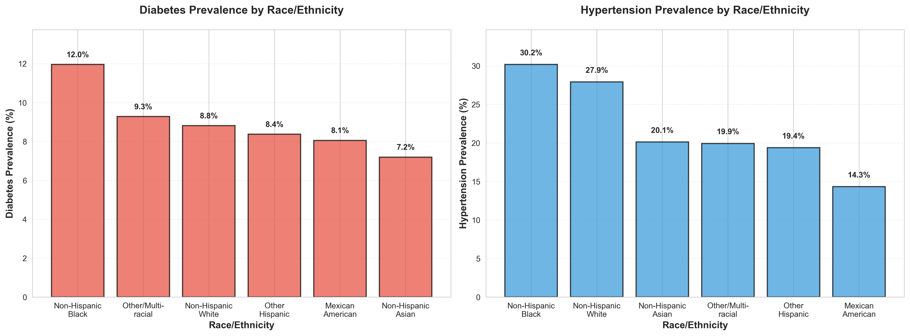

#### 2. Correlation Heatmap of Risk Factors
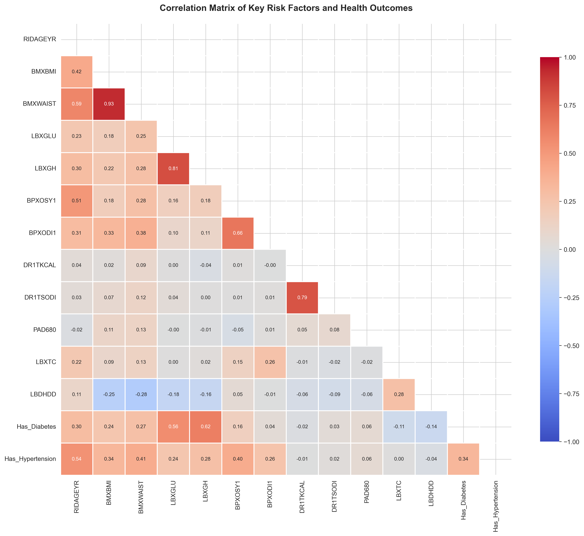

#### 3A. BMI Distributions by Diabetes Status
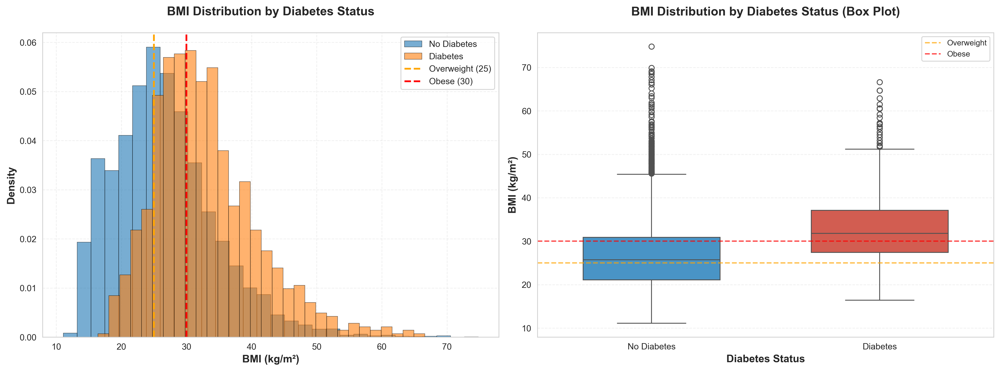

#### 3B. BMI Distributions by Hypertension Status
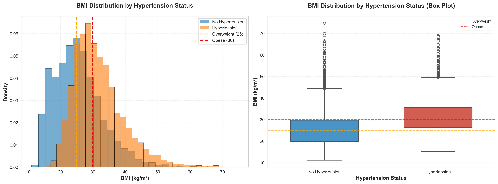

#### 4. Age Trends for Diabetes and Hypertension
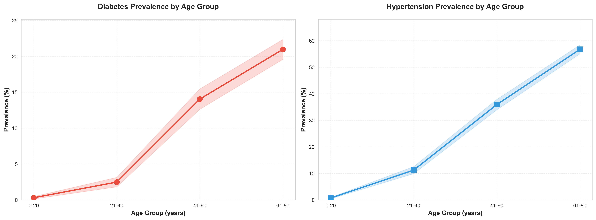

#### 5. Missing Data Patterns
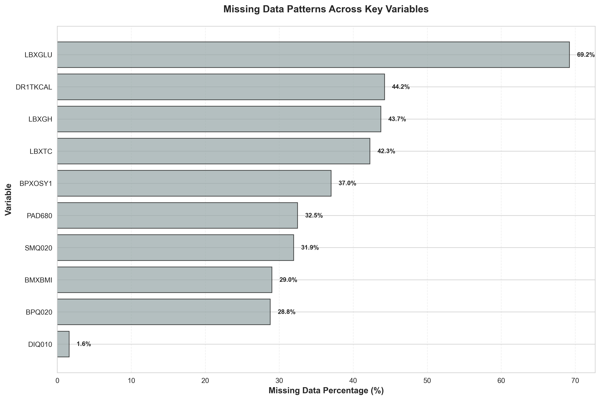

#### 6. Lifestyle Factors by Disease Status
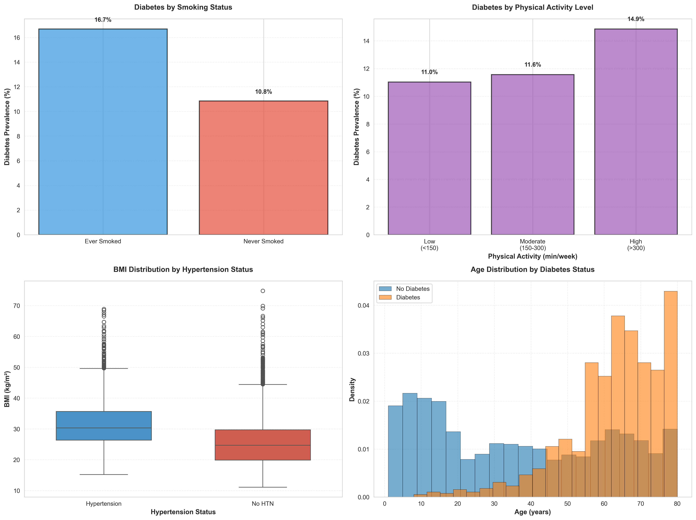

#### 7A. BMI by Race and Diabetes Status
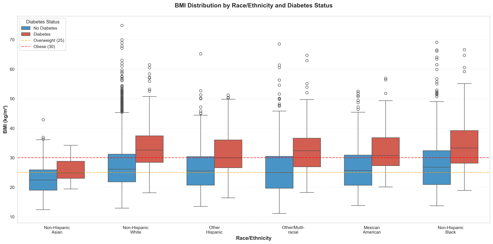

#### 7B. BMI by Race and Hypertension Status
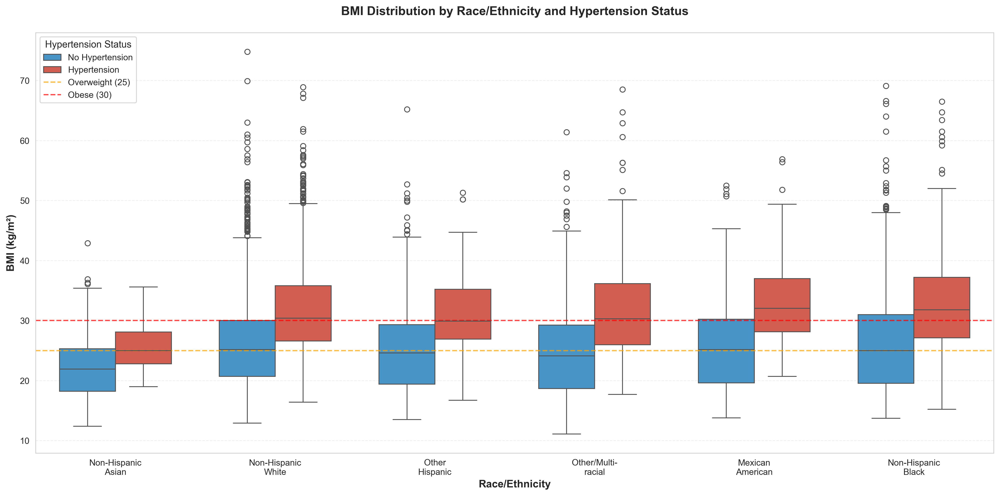

#### 8. Age-Stratified Disease Rates by Race
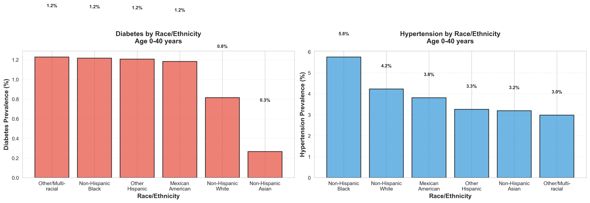

#### 9A. Diabetes Race-Stratified Lifestyle Interactions
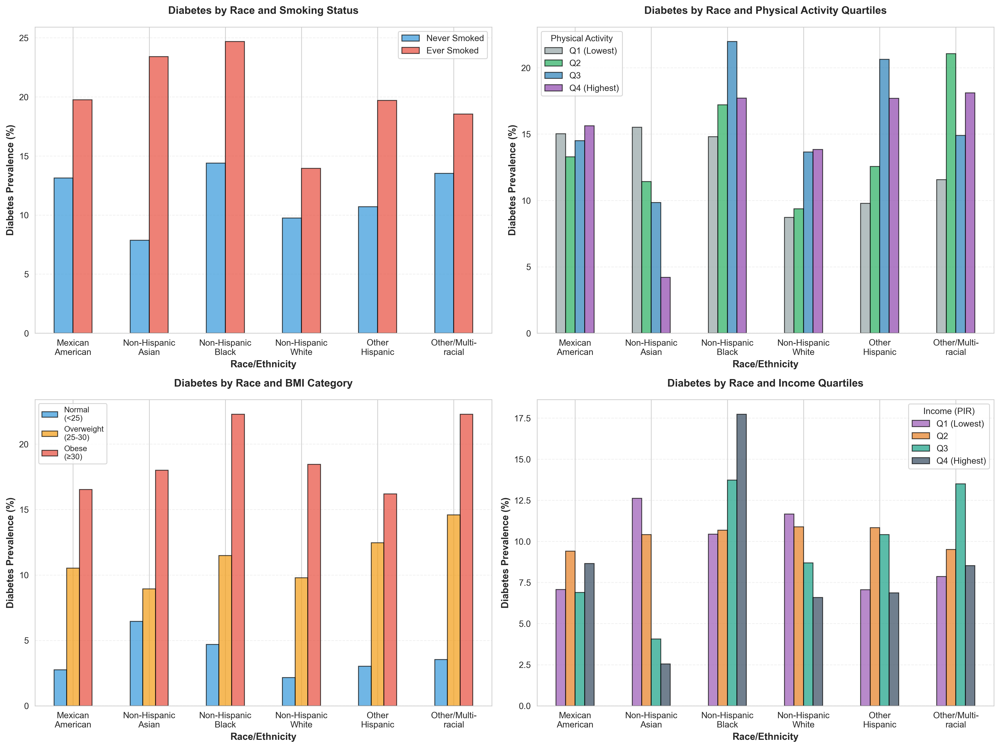

#### 9B. Hypertension Race-Stratified Lifestyle Interactions
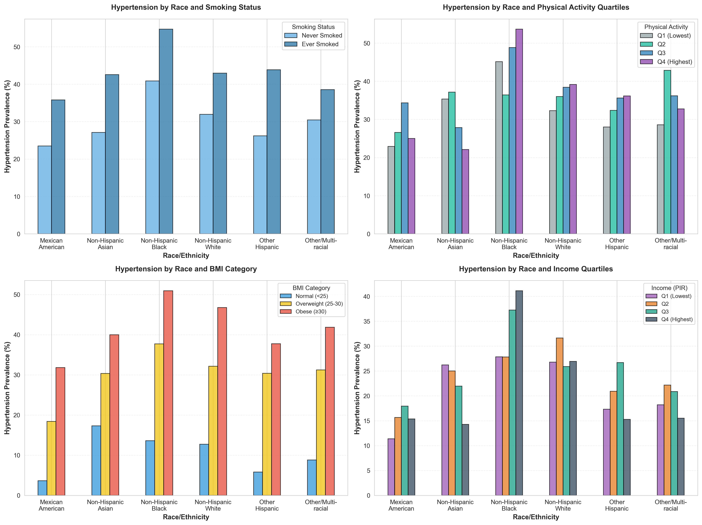

#### 10. Dietary Risk Patterns (Calories & Sodium)
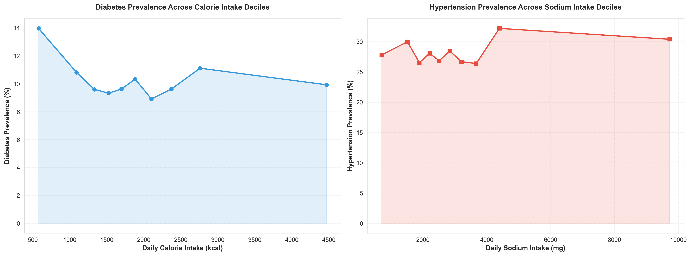

### Initial Feature Engineering Ideas

Based on the visualization findings, potential features to consider:

1. **BMI Categories:** Create categorical features (Normal <25, Overweight 25-30, Obese ≥30) instead of continuous BMI
2. **Age Groups:** Use age categories rather than continuous age to capture non-linear relationships
3. **Collinearity Reduction:** 
   - Use BMI and not waist circumference (avoid both)
   - Use HbA1c OR fasting glucose (not both)
   - Consider creating composite dietary scores rather than individual nutrients
4. **Interaction Terms:**
   - Race × BMI category
   - Race × Age group
   - Race × Income level
   - Age × Lifestyle factors
5. **Derived Features:**
   - Blood pressure category (normal, elevated, stage 1, stage 2)
   - Metabolic syndrome indicators
   - Dietary quality scores

### Anticipated Challenges

1. **Class Imbalance:**
   - Diabetes: ~9.2% prevalence (imbalanced binary classification)
   - Hypertension: ~35% prevalence (less imbalanced but still requires attention)
   - **Solution:** Consider stratified sampling, class weights, or SMOTE for diabetes prediction

2. **Missing Data Sparsity:**
   - Fasting glucose: 69.2% missing (only fasting subsample)
   - Dietary data: 43.9% missing
   - Alcohol: 58.7% missing
   - **Solution:** Multiple imputation, or use complete-case analysis with sensitivity analysis

3. **Multicollinearity:**
   - High correlations identified between key variables
   - **Solution:** Feature selection, regularization (L1/L2), or dimensionality reduction

4. **Reverse Causality:**
   - Physical activity may be affected by disease diagnosis
   - Dietary changes may follow disease diagnosis
   - **Solution:** Focus on modifiable risk factors, consider temporal ordering where possible

5. **Confounding:**
   - Age strongly confounds ethnic group comparisons
   - Income/education may confound lifestyle factors
   - **Solution:** Multivariable models with careful confounder adjustment, propensity score matching

6. **Small Sample Sizes in Subgroups:**
   - Some ethnic groups have smaller sample sizes
   - Age-stratified analyses may have limited power
   - **Solution:** Consider combining some ethnic groups, or use statistical methods robust to small samples

7. **Survey Design Complexity:**
   - NHANES uses complex survey weights
   - Current analysis treats as simple random sample
   - **Solution:** Incorporate survey weights (WTINT2YR, WTMEC2YR) for population-representative estimates if needed

