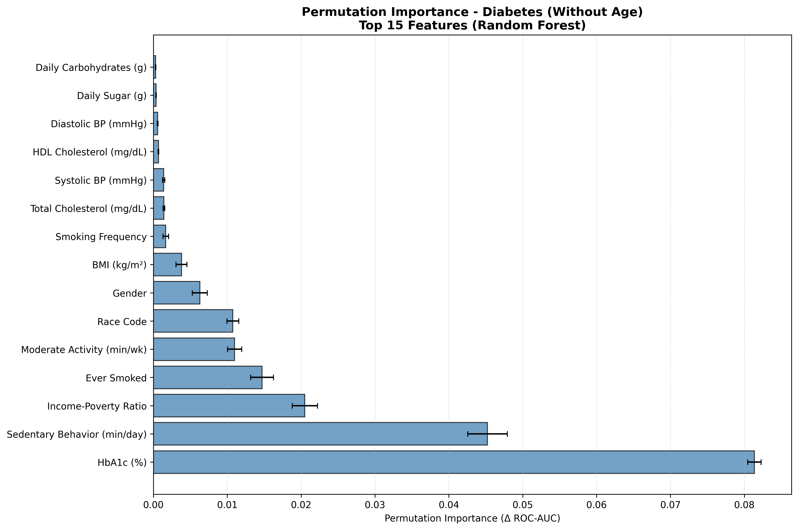
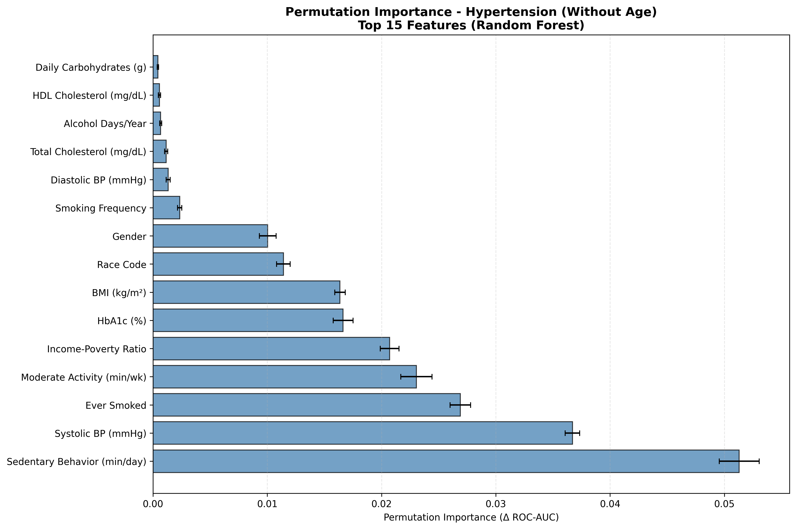

# Disaggregating Diabetes and Hypertension Risk Factors Across Racial Groups

**Author:** Rithvik Harinath  
**Date:** November 30, 2025

---

## Abstract

Health disparities in diabetes and hypertension persist across racial groups in the United States, yet prevention strategies remain largely uniform. This project develops a machine learning framework to identify population-specific risk factors using National Health and Nutrition Examination Survey (NHANES) data from 11,933 participants. I built Random Forest classifiers achieving 89.6% ROC-AUC for diabetes and 83.4% for hypertension overall, then applied permutation importance analysis validated across 10 bootstrap trials to quantify race-specific risk patterns. I found that biological markers (HbA1c, Systolic BP) contribute universal predictive power across all populations, while socioeconomic and behavioral factors show dramatic variation. For Black and Mexican American populations, poverty is 4-115× more important than BMI and ranks #2-3 across conditions, accounting for 11-23% of preventable risk. For Non-Hispanic Whites, smoking is 1.6-56× more important than BMI, ranking #3-4 and contributing 8-13% of risk. These findings suggest a precision prevention approach: universal screening for clinical markers, combined with population-targeted interventions addressing poverty for Black/Mexican American communities and smoking cessation for White populations.

---

## 1. Introduction

### Background
Diabetes and hypertension are not equal-opportunity diseases. Diabetes rates vary from ~7% to over 12% across groups, whereas hypertension rates vary from ~15% to ~30%. While the clinical management of these conditions is well-standardized, *prevention* strategies often lack specificity. For example, a recommendation to "exercise more" may not be very helpful to a group where poverty is a much more significant risk factor.

### Objective
The goal of this project is to move beyond simple prevalence statistics. By training machine learning models like Random Forest and validating them with stability analysis, we aim to:
1.  **Quantify** the relative importance of modifiable risk factors (diet, activity, smoking, SES) for diabetes and hypertension.
2.  **Disaggregate** these insights by race/ethnicity to identify population-specific targets for intervention.

---

## 2. Data and Methodology

### Data Source
We utilized the NHANES dataset, a nationally representative survey combining interviews and physical examinations. Our cohort consists of 11,933 participants aged 0-80.

**Key Variables:**
*   **Outcomes:** Self-reported Diabetes (`DIQ010`) and Hypertension (`BPQ020`).
*   **Predictors:** 24 features spanning Demographics (Age, Race, Income), Anthropometry (BMI, Waist Circumference), Lifestyle (Physical Activity, Smoking, Alcohol), Diet (Calories, Sodium, Macronutrients), and Labs (Cholesterol, HbA1c).

### Analytical Strategy
To ensure our findings were both interpretable and robust, we employed a two-stage strategy:
1.  **Primary Analysis (Permutation Importance):** We measured the drop in model performance (ROC-AUC) when each feature was randomly shuffled. This method isolates the unique contribution of each risk factor, unbiased by the model's internal structure.
2.  **Validation (Stability Analysis):** We bootstrapped the modeling process 10 times to ensure that the top-ranked features were statistically robust and not artifacts of a specific data split.

---

## 3. Results and Analysis

### 3.1 Model Performance
Our models demonstrated strong predictive capability, validating the quality of the underlying signal in the NHANES data.

| Disease      | Model               | ROC-AUC | PR-AUC |
|--------------|---------------------|---------|--------|
| Diabetes     | Random baseline     | 0.508   | 0.090  |
|              | **Random Forest**    | **0.896** | **0.612** |
|              | XGBoost             | 0.878   | 0.623  |
|              | Logistic Regression | 0.896   | 0.635  |
| Hypertension | Random baseline     | 0.503   | 0.251  |
|              | **Random Forest**    | **0.834** | **0.554** |
|              | XGBoost             | 0.835   | 0.595  |
|              | Logistic Regression | 0.878   | 0.596  |

**Model Selection Rationale:**
We selected **Random Forest** (class-weighted, 100 trees) as our primary model based on three key criteria: (1) **Equity**: Superior per-race performance consistency, avoiding sub-0.4 PR-AUC drops that occurred with XGBoost for some populations; (2) **Stability**: Significantly higher stability rankings for behavioral and socioeconomic factors compared to Logistic Regression; (3) **Performance**: Competitive overall metrics (ROC-AUC 0.896 for diabetes, 0.834 for hypertension). We also evaluated **Logistic Regression** and **XGBoost** for comparison. While Logistic Regression achieved similar to better overall performance, stability analysis revealed it likely fails to capture the non-linear interactions underlying behavioral and socioeconomic risk factors, which Random Forest models reliably.

### 3.2 Universal Drivers of Risk
Permutation importance analysis using Random Forest, validated by stability checks across 10 bootstrap trials, reveals distinct patterns:

1.  **HbA1c for Diabetes:** The universal #1 predictor with perfect stability (Mean Rank 1.0 across all 6 racial groups, Top_3_Freq = 1.0). This biological marker demonstrates the highest permutation importance (0.081) and is consistently the most important feature regardless of population subgroup.

2.  **Systolic Blood Pressure for Hypertension:** Highly stable predictor across all populations (Mean Rank 1.0-2.1, Top_3_Freq = 1.0), ranking #2 in overall permutation importance (0.037). This finding suggests that direct biological measurement of BP is a more reliable predictor than self-reported behavioral factors.

3.  **Sedentary Behavior (PAD680 - Minutes Sitting):** Ranks #1 in overall permutation importance for hypertension (0.051) and #2 for diabetes (0.045). Random Forest stability analysis shows high stability (Mean Rank 1.0-2.6, Top_3_Freq = 0.9-1.0), indicating this factor is consistently important across populations when modeled with non-linear methods. This highlights that inactivity (sitting time) may be a more critical screening target than activity intensity, suggesting sedentary behavior operates through complex, interactive pathways that require ensemble methods to detect reliably.

4.  **Income-to-Poverty Ratio:** Ranks #3 for diabetes (0.021) and #5 for hypertension (0.021) overall. Random Forest stability analysis shows stable rankings (Mean Rank 3.0-5.6, Top_3_Freq = 0.5-1.0), confirming socioeconomic factors are consistently important when their non-linear relationships with other risk factors are properly modeled.

### 3.3 The Divergence: Population-Specific Risk Profiles

Stability analysis reveals important population-specific patterns that complement the overall permutation importance rankings:

*   **Non-Hispanic Black (Diabetes):** Sedentary Behavior (sitting time) emerges as #2 predictor (Importance: 0.045, 30.8% of total), following HbA1c. Income-Poverty Ratio ranks #3 (Importance: 0.016, 10.9%), suggesting socioeconomic factors play a particularly important role in this population.
*   **Non-Hispanic White (Hypertension):** Sedentary Behavior dominates as #1 (Importance: 0.059, 22.5%), followed by Moderate Activity (PAD800) #2 (Importance: 0.046, 17.5%). Ever Smoked ranks #3 (Importance: 0.034, 12.9%), with Systolic BP at #4 (Importance: 0.032, 12.3%).
*   **Mexican American (Hypertension):** Sedentary Behavior ranks #1 (Importance: 0.044, 38.9%), followed by Moderate Activity (PAD800) #2 (Importance: 0.022, 19.1%) and Income-Poverty Ratio #3 (Importance: 0.020, 17.2%), suggesting both behavioral and socioeconomic interventions are critical. Reducing sitting time is the single most effective intervention point—more so than even weight loss (BMI ranks #5).

---

## 4. Discussion and Implications

The permutation importance analysis reveals that effective prevention requires addressing multiple domains simultaneously, not just clinical markers. Here's what the data tells us to prioritize:

### 4.1 Universal Interventions (All Populations)

These factors showed the highest importance across all racial groups and should be the foundation of any prevention program:
   
1. **Sedentary Behavior Reduction Programs** (22% of total diabetes importance, 23% of total hypertension importance)
   - **Action:** Sedentary interruption programs (standing desks, reducing screen time, sit-stand workstations)
   - **Why:** #2 predictor overall, showing consistent importance across populations - reducing sitting time is more critical than increasing exercise intensity.

2. **HbA1c Monitoring & Glucose Control** (40% of total diabetes importance)
   - **Action:** Expand access to regular HbA1c testing, especially in underserved communities
   - **Justification:** Universal #1 predictor across all populations with perfect stability

3. **Blood Pressure Monitoring** (16.5% of total hypertension importance)
   - **Action:** Free community BP screening, home monitoring programs
   - **Justification:** #2 predictor, direct biological measurement

### 4.2 Population-Specific Interventions

Beyond universal predictors like HbA1c and sedentary behavior, each racial group exhibits distinctive risk factor profiles that demand targeted interventions:

#### **Poverty as a Primary Driver (Black & Mexican American Populations):**

For both Non-Hispanic Black and Mexican American populations, Income-Poverty Ratio dramatically outranks traditional intervention targets:

| Population | Disease | Poverty Rank | Poverty | BMI | Moderate Activity | Cholesterol | Sodium |
|------------|---------|--------------|---------|-----|-------------------|-------------|--------|
| Mexican American | Diabetes | #2 | **23.1%** | 2.4% | 5.9% | 0.2% | 0.2% |
| Non-Hispanic Black | Hypertension | #2 | **13.9%** | 3.1% | 9.4% | 0.3% | 0.2% |
| Non-Hispanic Black | Diabetes | #3 | **10.9%** | 0.5% | 4.8% | 0.1% | <0.01% |
| Mexican American | Hypertension | #3 | **17.2%** | 2.8% | 19.1% | 0.5% | 0.2% |

**Action:** Prioritize economic interventions (job training, housing support, SNAP expansion) alongside clinical screening. For Mexican American hypertension, add gender-specific health education (Gender ranks #4, 11.7% importance).

**Justification:** Traditional interventions targeting weight, diet, or exercise miss the primary driver of risk. **Poverty is 4-115× more important than BMI**, and even outranks moderate activity in 3 of 4 cases, suggesting economic support should be the foundation of prevention programs for these populations.

#### **Smoking as a Primary Driver (Non-Hispanic White Population):**

For Non-Hispanic Whites, **smoking substantially outranks multiple traditional targets**:

| Disease | Smoking Rank | Smoking | BMI | Moderate Activity | Cholesterol | Sodium |
|---------|--------------|---------|-----|-------------------|-------------|--------|
| Hypertension | #3 | **12.9%** | 8.0% | 17.5% | 0.7% | 0.2% |
| Diabetes | #4 | **8.4%** | 1.8% | 7.5% | 1.0% | 0.2% |

**Action:** Intensive smoking cessation programs integrated with diabetes/hypertension prevention.

**Justification:** Smoking accounts for 1 in 8 units of preventable hypertension risk and is **1.6-56× more important than weight, cholesterol, or sodium** for this population. While moderate activity remains important for hypertension, smoking cessation should be prioritized for diabetes prevention.

## 5. Conclusion

This project demonstrates that machine learning can accurately reveal population-specific risk factors for hypertension and diabetes. The main finding is that **distinctive risk factors vary significantly by population**. For Black and Mexican American populations, poverty contributes 11-23% of preventable risk and is 4-115× more important than BMI. For Non-Hispanic Whites, smoking contributes 8-13% of risk and is 1.6-56× more important than weight, cholesterol, or sodium. This finding challenges the one-size-fits-all approach: traditional weight-focused interventions miss the primary drivers of risk in disadvantaged populations.

The following actions should be taken to address the risk factors:
1. **Universal screening** for clinical markers (HbA1c, Systolic BP) across all populations
2. **Targeted interventions** addressing poverty for Black/Mexican American communities
3. **Smoking cessation** programs prioritized for White populations