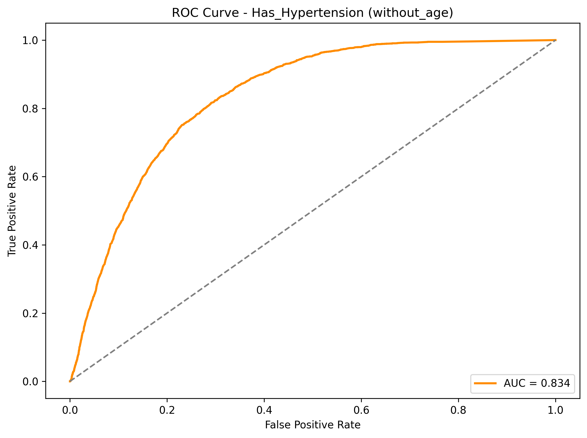
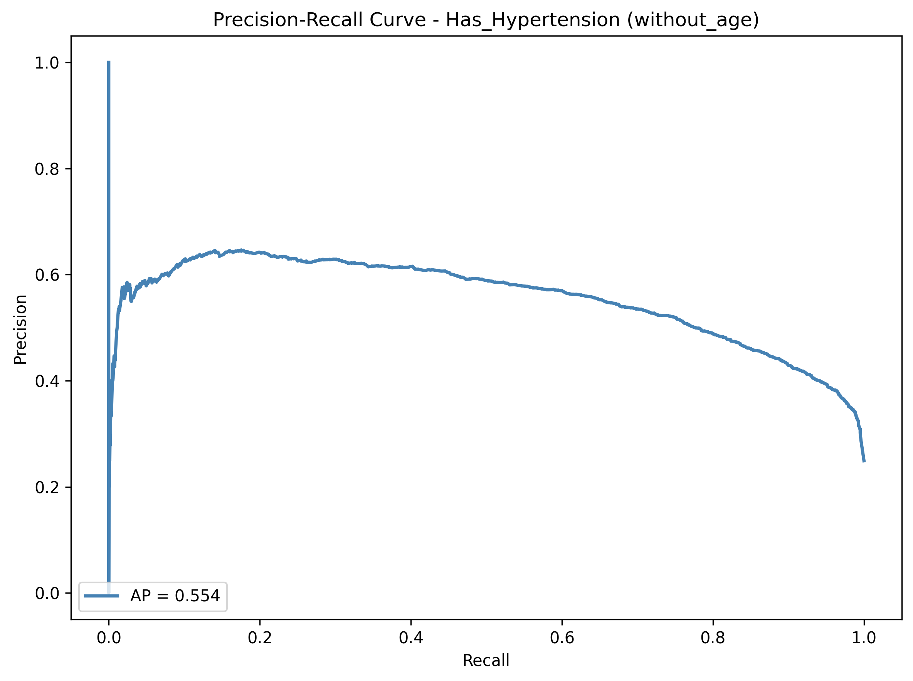
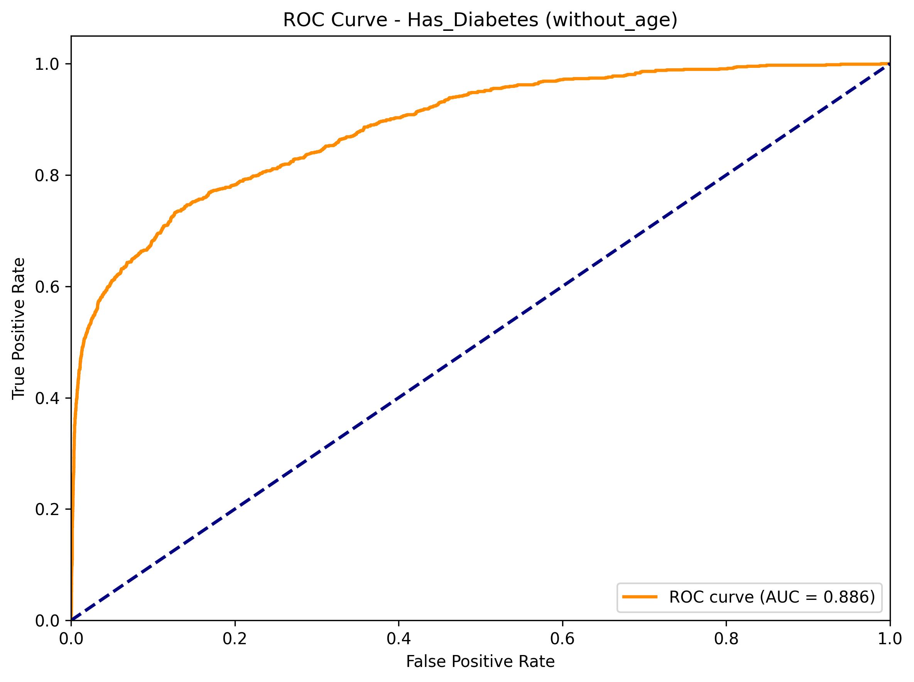
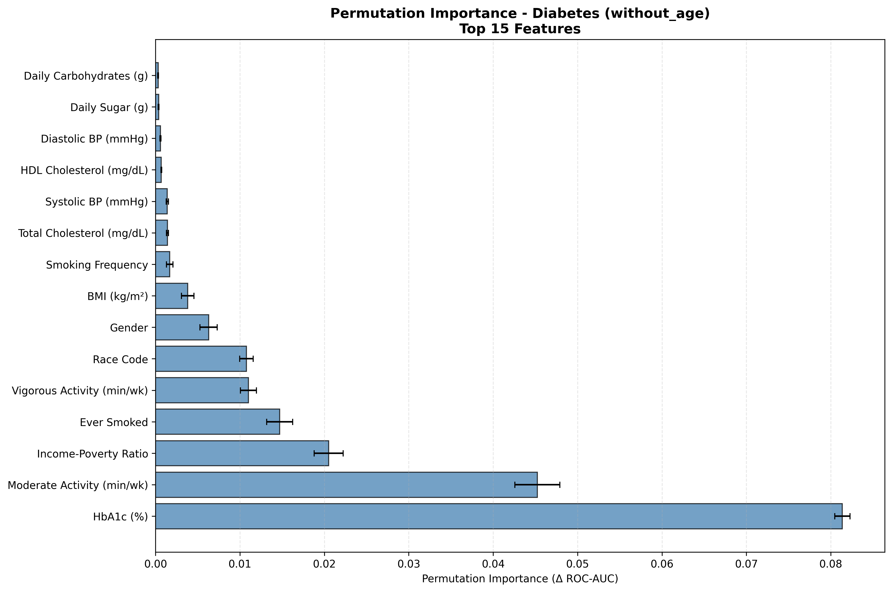
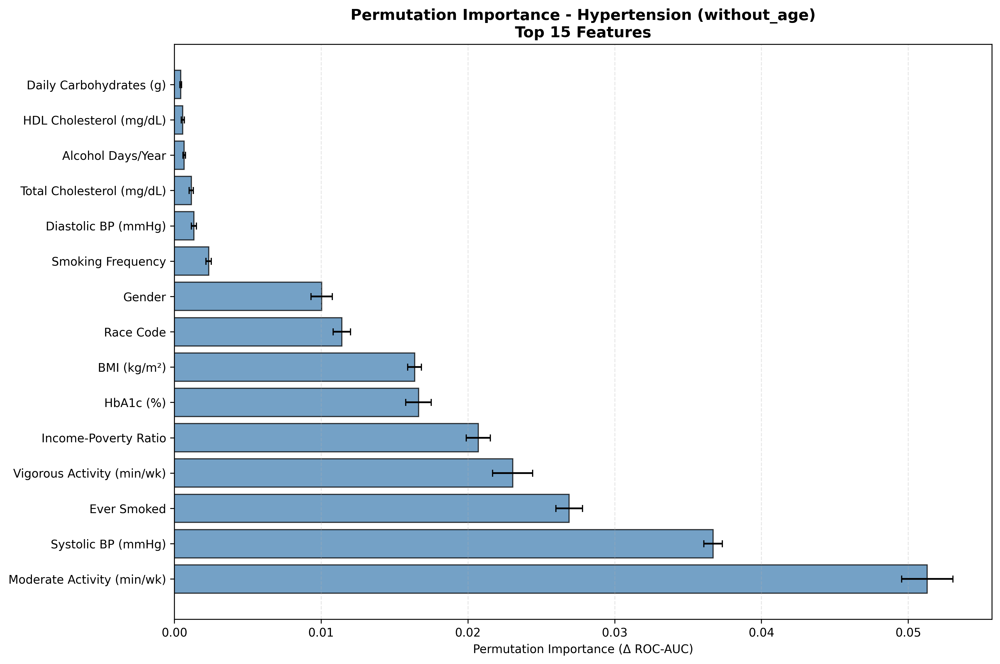

# NHANES Diabetes & Hypertension Modeling Summary

## Methodology

### Model Selection and Training

We trained two ensemble classifiers for diabetes and hypertension prediction:

1. **Random Forest** (500 trees, class weighting, median imputation)
2. **XGBoost** (500 estimators, max_depth=6, learning_rate=0.1, class weighting, median imputation)

For each algorithm we built:
- **Overall models** (full cohort) with and without age to quantify age’s confounding effect and surface modifiable drivers.
- **Race-specific models** (no age) to understand population-specific risk profiles.

**Feature set**: 24 covariates spanning demographics, BMI, physical activity, diet, smoking/alcohol, and clinical labs (HbA1c, cholesterol, blood pressure). We exclude `LBXGLU` (<insert description here>; sparse, near-leakage) and `BMXWAIST` (waist length; collinear with BMI).

### Model Evaluation and Comparison

We used 5-fold Stratified CV with:
- **ROC-AUC** (overall discrimination)
- **PR-AUC** (minority-class performance)

**Results**: Overall, Random Forest and XGBoost both had solid ROC-AUC scores and relatively good PR-AUC scores. They significantly outperformed the random baseline. After removing age, Random Forest achieved ROC-AUC of 0.896 on Diabetes and 0.834 on Hypertension for the overall data (not split by race). This is overall slightly better than XGBoost's ROC-AUC of 0.878 on Diabetss and 0.835 on Hypertension. Furthermore, Random Forest had slightly more stable race-specific performance compared to XGBoost. Thus, we decided to continue the evaluation using Random Forest.

### Feature Importance Analysis (Permutation Importance)

Permutation importance (ROC-AUC drop when shuffling a feature) is our primary interpretability method because it:
- Works with any saved RF pipeline.
- Shares attribution fairly among correlated variables.

We compute permutation importance for all overall and race-specific models using the stored pipelines, sampling up to 5k rows for overall models and using all rows for race-specific cohorts.

### Feature Importance Conclusions

- **Core modifiable drivers** (BMI, HbA1c, moderate activity, income-to-poverty ratio, smoking status, systolic BP) dominate risk for both diseases across all races.
- **Race-specific ordering** shifts slightly:
  - Diabetes: HbA1c, moderate activity, and poverty ratio form a common top trio. Non-Hispanic Asian is the only cohort where moderate activity is rank #1 (HbA1c #2, systolic BP #4); Mexican American elevates poverty ratio to rank #2; Non-Hispanic White and Other Hispanic cohorts rank “Ever Smoked” in the top four.
  - Hypertension: Activity and socioeconomic status typically lead, but systolic BP becomes rank #1 for Non-Hispanic Asian (activity #2) and reaches rank #3 for Non-Hispanic Black—higher than in Mexican American or Other/Multi-racial cohorts.
- **Age confounding**: Age overwhelms other factors when included; removing it reveals actionable lifestyle and socioeconomic levers.
- All permutation CSVs/plots can be found under `modeling_outputs/permutation_importance/` for deeper inspection.

## Baseline Strengths and Weaknesses

**Strengths**
- RF + XGBoost pipelines (overall and race-specific) address missingness, non-linear effects, and class imbalance with minimal tuning.
- Permutation-importance rankings generally agree with initial Gini importance but are less biased, providing reliable feature orderings for each saved model.
- ROC/PR curves demonstrate strong discrimination (overall ROC-AUC ≈ 0.90) despite low diabetes prevalence.
- Running models with and without age cleanly separates modifiable factors from confounding demographics.

**Weaknesses**
- Tree ensembles remain partially opaque; permutation importance orders features but does not show interaction directionality.
- Top predictors are dominated by HbA1c/BMI, which can mask subtler nutrition or lifestyle signals we may want to surface.
- Race-specific models can underfit in smaller cohorts (e.g., Non-Hispanic Asian hypertension), which may bring about variance in rankings.

## Model Visualizations

### Overall Model Performance Curves (without age)
_Random Forest_

_XGBoost_

### Overall Feature Importance (Random Forest, without age)

### Permutation Feature Importance
Every overall and race-specific RF model has a paired CSV + PNG saved as `modeling_outputs/permutation_importance/perm_importance_<model>.csv|.png`.

## Possible Reasons for Errors or Bias
- **Confounding/Proxy Features**: Age and HbA1c closely track diagnoses; using both can mask subtler drivers unless we remove age or evaluate stratified runs.
- **Class Imbalance**: Diabetes prevalence (~9%) lowers precision at high recall; PR curves highlight this, but threshold tuning is still needed.
- **Self-reported Measures**: Activity, smoking, and alcohol questions vary by SES/race, introducing measurement bias.
- **Survey Design**: We currently treat NHANES as a simple random sample; ignoring survey weights can bias population-level estimates.
- **Reverse Causality**: Diagnosed individuals may change diet/activity, so some correlations could reflect treatment effects rather than root causes.

## Ideas for Final Report / Next Steps

1. **Feature Engineering**
   - Derived ratios (sodium per kcal, metabolic syndrome indicators, BP categories).
   - Interaction terms (Race × BMI, SES × lifestyle, Age × PA).
   - Temporal ordering if multiple survey waves are combined.

2. **Modeling Enhancements**
   - Try out elastic-net logistic regression for interpretability.
   - Perform grid/random search for RF/XGBoost hyperparameters.
   - Use partial dependence/ALE plots to expose localized effects and interactions.

3. **Evaluation Improvements**
   - Add confusion matrices, calibration curves, and decision-threshold analyses per race.
   - Bootstrap ROC/PR metrics for confidence intervals.
   - Compute fairness metrics (equalized odds, demographic parity) across race/sex strata.

4. **Bias & Data Quality Checks**
   - Refit models with NHANES survey weights (WTINT2YR/WTMEC2YR) for population inference.
   - Conduct sensitivity analyses excluding proxy features or using multiple imputation for sparse labs.

5. **Clustering & Personas**
   - Extend KMeans/UMAP/HDBSCAN pipelines to profile “personas” grounded in lifestyle/dietary variables.
   - Use those personas to tailor recommendations for modifiable behaviors.

