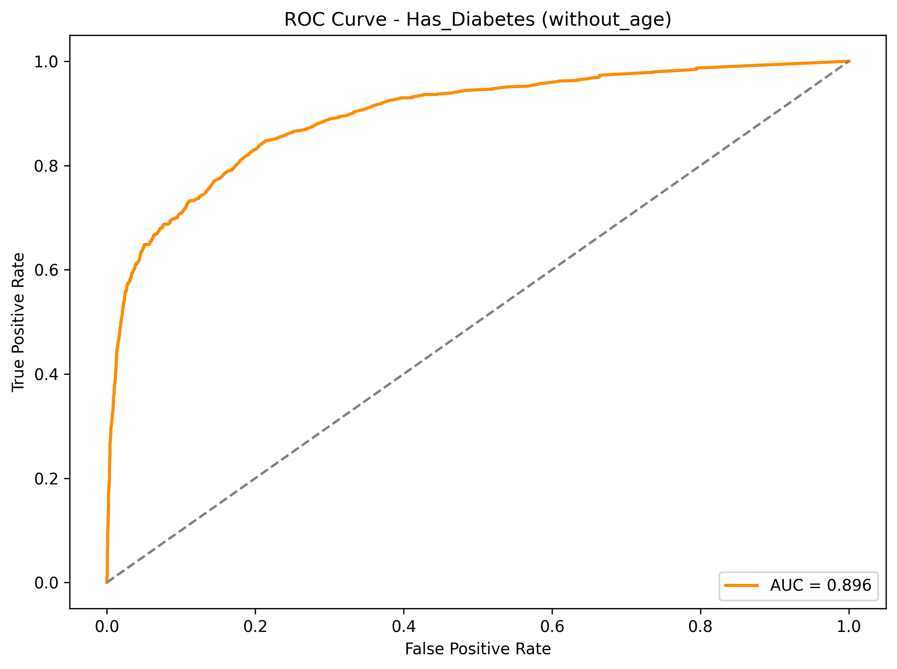
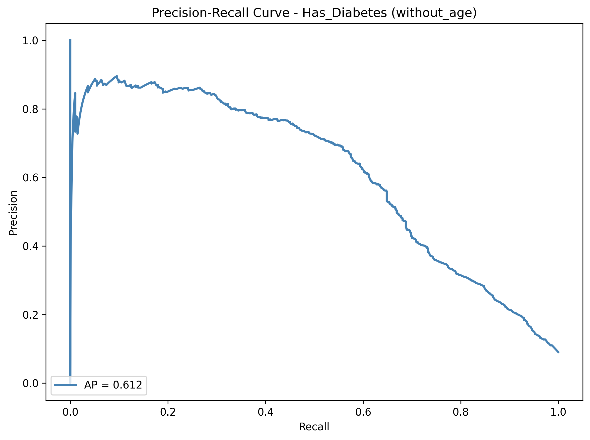
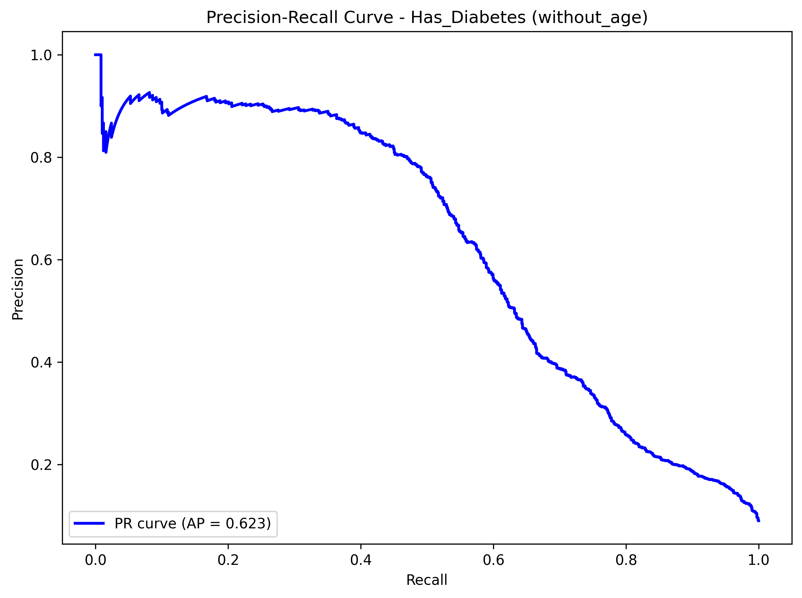
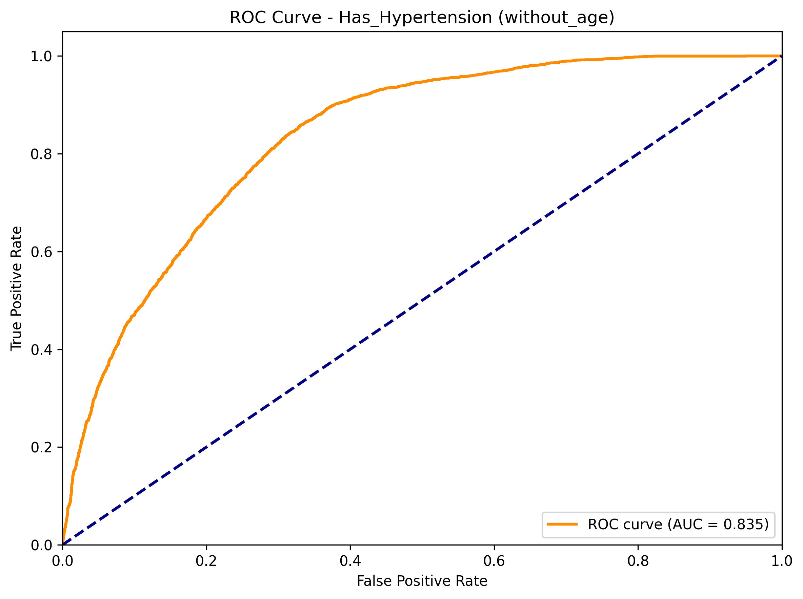
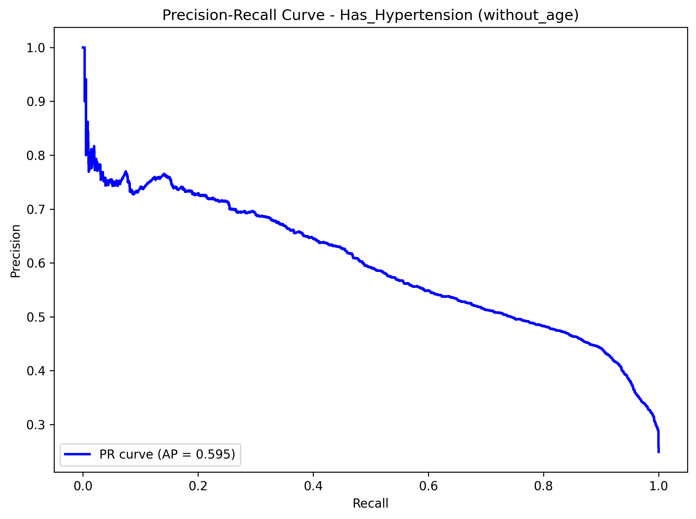

# NHANES Diabetes & Hypertension Modeling Summary

## Methodology

### Model Selection and Training

We trained two ensemble classifiers to predict whether a given person has diabetes or hypertension:

1. **Random Forest** (500 trees, class weighting, median imputation)
2. **XGBoost** (500 estimators, max_depth=6, learning_rate=0.1, class weighting, median imputation)

For each algorithm we built:
- **Overall models** (full cohort) with and without age to quantify age’s confounding effect and surface modifiable drivers.
- **Race-specific models** (no age) to understand population-specific risk profiles.

**Feature set**: 24 features including BMI, physical activity, diet, smoking/alcohol, and clinical labs (HbA1c, cholesterol, blood pressure). We exclude `LBXGLU` (fasting plasma glucose; collinear with HbA1c) and `BMXWAIST` (waist length; collinear with BMI).

### Model Evaluation and Comparison

We used 5-fold Stratified CV with:
- **ROC-AUC** (overall discrimination)
- **PR-AUC** (minority-class performance)

**Results** (overall models, without age):

| Disease      | Model             | ROC-AUC | PR-AUC |
|--------------|-------------------|---------|--------|
| Diabetes     | Random baseline   | 0.508   | 0.090  |
|              | Random Forest     | 0.896   | 0.612  |
|              | XGBoost           | 0.878   | 0.623  |
| Hypertension | Random baseline   | 0.503   | 0.251  |
|              | Random Forest     | 0.834   | 0.554  |
|              | XGBoost           | 0.835   | 0.595  |

Overall, Random Forest and XGBoost both had solid ROC-AUC scores and relatively good PR-AUC scores compared to the random baseline They significantly outperformed the random baseline. Random Forest seemed to have better ROC than XGBoost, but XGBoost outperformed Random Forest in PR-AUC. However, after looking at XGBoost's race-specific ROC and PR curves, it appeared that it was performing somewhat worse (for example, hitting below .4 PR-AUC for Hypertension on several races which Random Forest never did) and more inconsistently than Random Forest. We decided to continue the evaluation using Random Forest for this reason on the first draft, but we may explore XGBoost for the final version of the project. 

### Feature Importance Analysis (Permutation Importance)

Permutation importance (ROC-AUC drop when shuffling a feature) is our primary interpretability method because it:
- Works with any saved RF pipeline.
- Shares attribution fairly among correlated variables.

We calculate permutation importance for all overall and race-specific models using the stored model pipelines for each demographic group, sampling up to 5k rows for overall models and using all rows for racial groups.

### Feature Importance Conclusions

- **Most significant risk factors overall:** (BMI, HbA1c, moderate activity, income-to-poverty ratio, smoking status, systolic BP) are consistently significant risk factors for both diseases across all races.
- **Race-specific ordering** shifts slightly:
  - Diabetes: HbA1c was the most commonly seen most significant diabetes factor for each race. HbA1c, moderate activity, and poverty ratio were the three most prominent features for diabetes for each race. Non-Hispanic Asian is the only racial group where moderate activity is rank #1 (HbA1c #2). Mexican Americans are the only group with poverty at rank #2. Non-Hispanic White and Other Hispanic racial groups rank “Ever Smoked” in the top four.
  - Hypertension: Activity and socioeconomic status typically led, but systolic BP was rank #1 for Non-Hispanic Asian (activity #2) and was rank #3 for Non-Hispanic Black. Income ratio was #2 for Non-Hispanic Black and Other Hispanic.
- **Age is confounding**: Age overwhelms other factors when included. Removing it shifts the model's emphasis to actionable lifestyle and socioeconomic factors.
- All permutation CSVs/plots can be found under `modeling_outputs/permutation_importance/` for more info.

## Baseline Strengths and Weaknesses

**Strengths**
- RF + XGBoost pipelines (overall and race-specific) address missingness, non-linear effects, and class imbalance with minimal tuning.
- Permutation-importance rankings generally agree with initial Gini importance but are less biased, providing reliable feature orderings for each saved model.
- ROC/PR curves demonstrate relatively strong discrimination in the face of low diabetes prevalence.
- Running models with and without age cleanly separates modifiable factors from age, which is a confounding demographic.

**Weaknesses**
- Tree ensembles remain partially opaque. Permutation importance orders features but does not show interaction directionality.
- Top predictors are dominated by HbA1c/BMI, which can mask subtler nutrition or lifestyle signals we may want to reveal and analyze.
- Race-specific models can underfit in smaller racial groups (e.g., Non-Hispanic Asian hypertension), which may bring about variance in rankings.

## Model Visualizations

### Overall Model Performance Curves (without age)
_Random Forest_

_XGBoost_

### Permutation Feature Importance

### Permutation Feature Importance
Every overall and race-specific RF model has a paired CSV + PNG saved as `modeling_outputs/permutation_importance/perm_importance_<model>.csv|.png`.

## Possible Reasons for Errors or Bias
- **Confounding/Proxy Features**: Age and HbA1c closely track diagnoses. Using both can mask subtler driving features unless we remove age (which we did) or evaluate stratified runs.
- **Class Imbalance**: Diabetes prevalence (~9%) lowers precision at high recall. PR curves highlight this, but threshold tuning is still needed.
- **Self-reported Measures**: Activity, smoking, and alcohol questions vary by SES/race, introducing measurement bias.
- **Survey Design**: We currently treat NHANES as a simple random sample. Ignoring survey weights can bias population-level estimates.
- **Reverse Causality**: Diagnosed individuals may change diet/activity, so some correlations could reflect treatment effects rather than root causes.

## Ideas for Final Report / Next Steps

1. **Feature Engineering**
   - Derived ratios (sodium per kcal, metabolic syndrome indicators, BP categories).
   - Interaction terms (Race × BMI, SES × lifestyle, Age × PA).
   - Expand features with anthropometric/diet/activity composites (waist-to-height ratio, lipid ratios, sedentary time), richer behavioral history (smoking pack-years, alcohol patterns), and socioeconomic context (education, insurance, survey-weighted indicators).

2. **Modeling Enhancements**
   - Try out logistic regression for interpretability.
   - Perform grid/random search for RF/XGBoost hyperparameters.
   - Use partial dependence/ALE plots to expose localized effects and interactions.

3. **Evaluation Improvements**
   - Add confusion matrices, calibration curves, and decision-threshold analyses per race.
   - Bootstrap ROC/PR metrics for confidence intervals.
   - Compute fairness metrics (equalized odds, demographic parity) across race/sex strata.

4. **Bias & Data Quality Checks**
   - Refit models with NHANES survey weights (WTINT2YR/WTMEC2YR) for population inference.
   - Conduct sensitivity analyses excluding proxy features or using multiple imputation for sparse labs.

5. **Clustering & Personas**
   - Use KMeans/UMAP/HDBSCAN pipelines to profile “personas” grounded in lifestyle/dietary variables.
   - Use those personas to tailor recommendations for modifiable behaviors.

